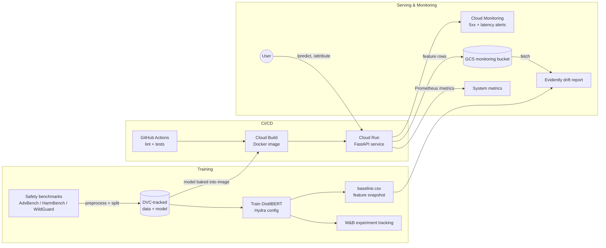

# SHAPIQ Attribution for Prompt-Risk Classification

<p align="center">
  <a href="https://www.python.org/downloads/"></a>
  <a href="LICENSE"></a>
  <a href="https://github.com/astral-sh/ruff"></a>
  <a href="https://github.com/mmschlk/shapiq"></a>
</p>

A prompt-risk classifier that not only scores how unsafe a prompt is, but explains the
score with Shapley interaction values — surfacing the tokens and token interactions
that drive risky and safe predictions.

<p align="center">
  
</p>

**Live demo:** <https://shapiq-api-i75daaw2la-ew.a.run.app>

## Overview

1. **Classification.** A fine-tuned DistilBERT model (or Llama Guard 3 1B) estimates
   `P(unsafe)` for an input prompt.
2. **Attribution.** `SafetyAnalysisGame`, a subclass of `shapiq.Game`, wraps the
   classifier so Shapley interaction values can attribute the prediction to
   individual tokens and their interactions.
3. **Serving.** A FastAPI service exposes both, plus a web UI for interactive
   exploration.

## Architecture



## Quickstart

Requires Python 3.13 and [`uv`](https://docs.astral.sh/uv/).

```bash
# Install dependencies
uv sync

# Pull DVC-tracked data and model artifacts (required before serving)
uv run dvc pull
```

Serve the API with Docker:

```bash
docker build -t shapiq-api:latest -f dockerfiles/api.dockerfile .
docker run -p 8000:8000 -v "$PWD/models:/app/models:ro" shapiq-api:latest
```

The web interface is then available at <http://localhost:8000>. See [API.md](API.md)
for the API endpoints and request/response schemas, and
[deploy/README.md](deploy/README.md) for the GCP deployment runbook.

## Monitoring

- **System metrics** — Prometheus counters and latency histograms at `/metrics`,
  plus the [Cloud Run metrics tab](https://console.cloud.google.com/run/detail/europe-west1/shapiq-api/metrics?project=mlops-shapiq-project).
- **Alerts** — Cloud Monitoring email policies for 5xx responses and p95 latency
  ([deploy/alerts.sh](deploy/alerts.sh)).
- **Data drift** — live predictions are logged to a GCS bucket and compared against
  the training baseline with Evidently at
  [/monitoring](https://shapiq-api-i75daaw2la-ew.a.run.app/monitoring).

## Dataset

Prompts come from public safety benchmarks (AdvBench, HarmBench, WildGuard),
normalized to a shared JSONL schema and split into train/val/test — all
DVC-tracked.

## Project structure

```text
├── configs/                  # Hydra configuration files
├── data/                     # Raw and processed datasets (DVC-tracked)
├── deploy/                   # Cloud Run deployment and alerting scripts
├── dockerfiles/              # Training and API Dockerfiles
├── docs/                     # MkDocs documentation
├── models/                   # Trained model artifacts (DVC-tracked)
├── notebooks/                # Exploratory notebooks
├── reports/                  # Metrics, reports, and figures
├── src/shapiq_attribution/   # Project package
├── tests/                    # Unit tests
├── pyproject.toml
└── tasks.py
```

## Tech stack

- **Model** — DistilBERT (Hugging Face Transformers), configured with Hydra
- **Explainability** — [shapiq](https://github.com/mmschlk/shapiq) Shapley interaction values
- **Data & model versioning** — DVC
- **Experiment tracking** — Weights & Biases
- **API** — FastAPI + Docker
- **CI/CD** — GitHub Actions + Cloud Build → Cloud Run
- **Monitoring** — Prometheus metrics, Cloud Monitoring alerts, Evidently drift reports
- **Quality** — pytest, ruff, mypy, pre-commit

## Development

```bash
uv run pytest tests/              # run the test suite
uv run ruff check . --fix         # lint and autofix
uv run ruff format .              # format
```

## License and acknowledgements

Released under the [MIT License](LICENSE). Built with
[shapiq](https://github.com/mmschlk/shapiq) and based on
[mlops_template](https://github.com/SkafteNicki/mlops_template).
