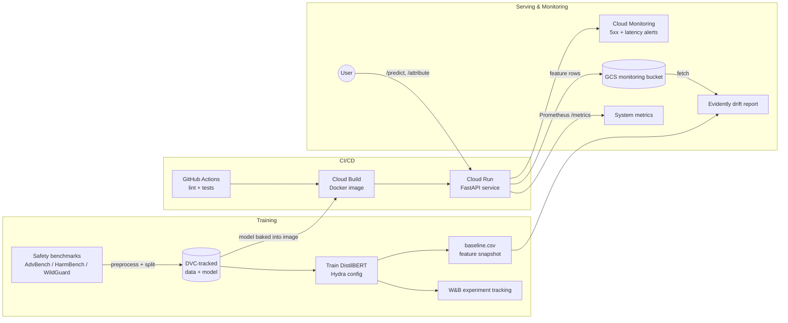

# SHAPIQ Attribution for Prompt-Risk Classification

<p align="center">
  <a href="https://www.python.org/downloads/"></a>
  <a href="LICENSE"></a>
  <a href="https://github.com/astral-sh/ruff"></a>
  <a href="https://github.com/mmschlk/shapiq"></a>
</p>

A prompt-risk classifier that not only scores how unsafe a prompt is, but explains the
score with Shapley interaction values — surfacing the individual tokens and token
interactions that drive risky and safe predictions.

<p align="center">
  
</p>

## Contents

- [Overview](#overview)
- [MLOps workflow](#mlops-workflow)
- [Installation](#installation)
- [Usage](#usage)
  - [Serving the API](#serving-the-api)
  - [API reference](#api-reference)
- [Where to find metrics, alerts, and drift](#where-to-find-metrics-alerts-and-drift)
- [Dataset](#dataset)
- [Development](#development)
- [Repository structure](#repository-structure)
- [License and acknowledgements](#license-and-acknowledgements)

## Overview

The pipeline has three stages:

1. **Classification.** Llama Guard 3 (1B) or a fine-tuned DistilBERT model estimates
   `P(unsafe)` for an input prompt.
2. **Attribution.** `SafetyAnalysisGame`, a subclass of `shapiq.Game`, wraps the
   classifier so that Shapley interaction values can attribute the prediction to
   individual tokens and their interactions.
3. **Serving.** A FastAPI service exposes both the classifier and the attribution,
   together with a lightweight web interface for interactive exploration.

## MLOps workflow

The project follows an end-to-end MLOps workflow:

- **Data versioning** with DVC: raw safety benchmarks (AdvBench, HarmBench, WildGuard)
  are normalized, split, and tracked alongside the trained model artifacts.
- **Model training** of a DistilBERT prompt-risk classifier with Hugging Face
  Transformers, configured via Hydra.
- **Experiment tracking** with Weights & Biases.
- **Automated testing, linting, and typing** with pytest, ruff, and mypy (pre-commit hooks).
- **Continuous integration** with GitHub Actions (separate lint, API, and training workflows).
- **Containerization** with Docker (local dev images plus a self-contained Cloud Run image).
- **Deployment** to Google Cloud Run via Cloud Build (`deploy/cloudrun.sh`).
- **System monitoring** through a Prometheus-compatible `/metrics` endpoint
  (request counts, latencies, predicted-label counters).
- **Input–output data collection** from the deployed service: every prediction's
  monitoring features are uploaded to a GCS bucket.
- **Data drift detection** with Evidently, comparing live predictions against the
  training-set baseline.
- **Cloud alerting** with Google Cloud Monitoring (5xx and latency alert policies,
  `deploy/alerts.sh`).

### System architecture



## Installation

The project targets Python 3.13 and uses [`uv`](https://docs.astral.sh/uv/) for
dependency management.

```bash
uv sync
```

Datasets and trained model artifacts are versioned with [DVC](https://dvc.org/). Pull them
before serving or evaluating:

```bash
uv run dvc pull
```

> **Note**  The `models/` directory must contain the trained classifier weights for the
> API to start. These are retrieved via `uv run dvc pull`.

## Usage

### Serving the API

Build and run the service in Docker. The `models/` volume mount provides the trained model
artifacts to the container (read-only):

```bash
# Build the image
docker build -t shapiq-api:latest -f dockerfiles/api.dockerfile .

# Run, mounting the trained models
docker run -p 8000:8000 -v "$PWD/models:/app/models:ro" shapiq-api:latest
```

The web interface is then available at <http://localhost:8000>. To stop the container,
run `docker stop <container>` (or `docker compose down` if started via Compose).

### API reference

| Endpoint     | Method | Description                                       |
| ------------ | ------ | ------------------------------------------------- |
| `/health`    | GET    | Service health check                              |
| `/predict`   | POST   | Returns the risk score for a prompt               |
| `/attribute` | POST   | Returns the risk score with per-word attributions |
| `/metrics`   | GET    | Prometheus system metrics (requests, latency, labels) |
| `/monitoring`| GET    | Evidently drift-detection dashboard (live vs baseline) |

See [API.md](API.md) for the full API guide: quickstart options (cloud / Docker /
local), request and response schemas, configuration, monitoring hooks, and the
Cloud Run deployment.

## Where to find metrics, alerts, and drift

> Setting all of this up from scratch (fresh machine or your own GCP project)?
> Follow the step-by-step runbook in [deploy/README.md](deploy/README.md) —
> prerequisites, one-command deploy, and the alerts script. The links below
> assume the existing `mlops-shapiq-project` deployment.

### System metrics (M28)

The API exposes Prometheus metrics directly:

```bash
curl https://shapiq-api-i75daaw2la-ew.a.run.app/metrics
```

The three custom metrics are `api_requests_total` (per endpoint + status code),
`api_request_duration_seconds` (latency histograms per endpoint), and
`api_predicted_labels_total` (risky vs safe — a collapsed model shows up here).
Counters live in process memory, so they reset when the Cloud Run instance
recycles. The service-level metrics (request count, latency, instances, memory)
are on the
[Cloud Run metrics tab](https://console.cloud.google.com/run/detail/europe-west1/shapiq-api/metrics?project=mlops-shapiq-project).

### Alerts (M28)

Two Cloud Monitoring policies, created by [`deploy/alerts.sh`](deploy/alerts.sh),
notify by email: **any 5xx responses** (5-minute window) and **p95 latency
above 30 s** (high on purpose — `/attribute` legitimately takes tens of
seconds). View or silence them in the
[alerting console](https://console.cloud.google.com/monitoring/alerting?project=mlops-shapiq-project),
or list them from the terminal:

```bash
gcloud alpha monitoring policies list --project mlops-shapiq-project \
  --format 'value(displayName,enabled)'
```

### Drift detection (M27)

The deployed drift dashboard is served by the API itself — open
**<https://shapiq-api-i75daaw2la-ew.a.run.app/monitoring>** (rebuilt per request
from the GCS-logged predictions vs the training baseline; takes a few seconds,
and returns 404 until at least one `/predict` has been logged).

The same report can be built locally from the live data:

```bash
MONITORING_BUCKET=mlops-shapiq-project-monitoring uv run invoke monitor-report-cloud
open reports/monitoring/drift_report.html
```

The raw collected input–output data is one JSON blob per prediction (the prompt
text plus `prompt_len`, `token_count`, and `p_risky`):

```bash
gcloud storage ls gs://mlops-shapiq-project-monitoring/predictions/
```

## Dataset

Prompts are drawn from public safety benchmarks and normalized to a shared JSONL schema:

```text
data/raw/                       data/processed/
├── advbench.jsonl              ├── prompt_risk_dataset.jsonl
├── harmbench.jsonl             ├── train.jsonl
└── wildguard_safe.jsonl        ├── val.jsonl
                                └── test.jsonl
```

## Development

```bash
uv run pytest tests/              # run the test suite
uv run ruff check . --fix         # lint and autofix
uv run ruff format .              # format
```

## Repository structure

```text
├── configs/                  # Configuration files
├── data/                     # Raw and processed datasets (DVC-tracked)
├── dockerfiles/              # Training and API Dockerfiles
├── docs/                     # MkDocs documentation
├── models/                   # Trained model artifacts (DVC-tracked)
├── notebooks/                # Exploratory notebooks
├── reference/                # Planning and research notes
├── reports/                  # Metrics, reports, and figures
├── src/shapiq_attribution/   # Project package
├── tests/                    # Unit tests
├── pyproject.toml
├── tasks.py
└── uv.lock
```

## License and acknowledgements

Released under the [MIT License](LICENSE). Built with
[shapiq](https://github.com/mmschlk/shapiq) for Shapley interaction values and based on [mlops_template](https://github.com/SkafteNicki/mlops_template).
