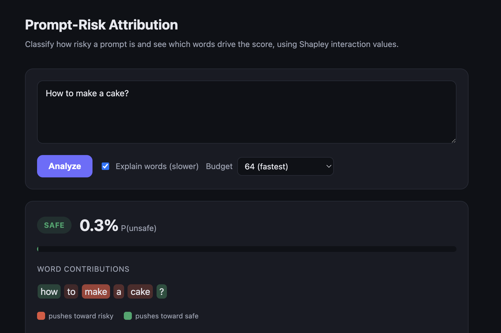

# SHAPIQ Attribution for Prompt-Risk Classification

<p align="center">
  <a href="https://www.python.org/downloads/"></a>
  <a href="LICENSE"></a>
  <a href="https://github.com/astral-sh/ruff"></a>
  <a href="https://github.com/mmschlk/shapiq"></a>
</p>

A prompt-risk classifier that not only scores how unsafe a prompt is, but explains the
score with Shapley interaction values — surfacing the individual tokens and token
interactions that drive risky and safe predictions.

<p align="center">
  
</p>

## Contents

- [Overview](#overview)
- [Installation](#installation)
- [Usage](#usage)
  - [Serving the API](#serving-the-api)
  - [API reference](#api-reference)
- [Dataset](#dataset)
- [Development](#development)
- [Repository structure](#repository-structure)
- [License and acknowledgements](#license-and-acknowledgements)

## Overview

The pipeline has three stages:

1. **Classification.** Llama Guard 3 (1B) or a fine-tuned DistilBERT model estimates
   `P(unsafe)` for an input prompt.
2. **Attribution.** `SafetyAnalysisGame`, a subclass of `shapiq.Game`, wraps the
   classifier so that Shapley interaction values can attribute the prediction to
   individual tokens and their interactions.
3. **Serving.** A FastAPI service exposes both the classifier and the attribution,
   together with a lightweight web interface for interactive exploration.

## Installation

The project targets Python 3.13 and uses [`uv`](https://docs.astral.sh/uv/) for
dependency management.

```bash
uv sync
```

Datasets and trained model artifacts are versioned with [DVC](https://dvc.org/). Pull them
before serving or evaluating:

```bash
uv run dvc pull
```

> **Note**  The `models/` directory must contain the trained classifier weights for the
> API to start. These are retrieved via `uv run dvc pull`.

## Usage

### Serving the API

Build and run the service in Docker. The `models/` volume mount provides the trained model
artifacts to the container (read-only):

```bash
# Build the image
docker build -t shapiq-api:latest -f dockerfiles/api.dockerfile .

# Run, mounting the trained models
docker run -p 8000:8000 -v "$PWD/models:/app/models:ro" shapiq-api:latest
```

The web interface is then available at <http://localhost:8000>. To stop the container,
run `docker stop <container>` (or `docker compose down` if started via Compose).

### API reference

| Endpoint     | Method | Description                                       |
| ------------ | ------ | ------------------------------------------------- |
| `/health`    | GET    | Service health check                              |
| `/predict`   | POST   | Returns the risk score for a prompt               |
| `/attribute` | POST   | Returns the risk score with per-word attributions |

## Dataset

Prompts are drawn from public safety benchmarks and normalized to a shared JSONL schema:

```text
data/raw/                       data/processed/
├── advbench.jsonl              ├── prompt_risk_dataset.jsonl
├── harmbench.jsonl             ├── train.jsonl
└── wildguard_safe.jsonl        ├── val.jsonl
                                └── test.jsonl
```

## Development

```bash
uv run pytest tests/              # run the test suite
uv run ruff check . --fix         # lint and autofix
uv run ruff format .              # format
```

## Repository structure

```text
├── configs/                  # Configuration files
├── data/                     # Raw and processed datasets (DVC-tracked)
├── dockerfiles/              # Training and API Dockerfiles
├── docs/                     # MkDocs documentation
├── models/                   # Trained model artifacts (DVC-tracked)
├── notebooks/                # Exploratory notebooks
├── reference/                # Planning and research notes
├── reports/                  # Metrics, reports, and figures
├── src/shapiq_attribution/   # Project package
├── tests/                    # Unit tests
├── pyproject.toml
├── tasks.py
└── uv.lock
```

## License and acknowledgements

Released under the [MIT License](LICENSE). Built with
[shapiq](https://github.com/mmschlk/shapiq) for Shapley interaction values and based on [mlops_template](https://github.com/SkafteNicki/mlops_template).
