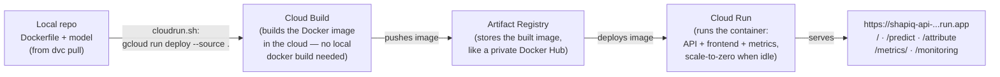

# Deployment, monitoring & alerting (M23 / M27 / M28)

Everything operational for the deployed prompt-risk API: how to deploy it to
**Google Cloud Run**, what metrics we collect, where each signal is stored, and
how to pull the collected prediction data locally. All commands are run from
the repo root, with the environment set up (`uv sync --extra cpu`).

## The live service

The API runs as the Cloud Run service `shapiq-api` in project
**`mlops-shapiq-project`** (region `europe-west1`):

| What | Where |
|------|-------|
| Web frontend | <https://shapiq-api-268593597387.europe-west1.run.app> |
| API documentation (interactive Swagger UI for all endpoints) | <https://shapiq-api-268593597387.europe-west1.run.app/docs> |
| Prometheus system metrics | <https://shapiq-api-268593597387.europe-west1.run.app/metrics/> |
| Evidently data-drift dashboard (live traffic vs. training baseline) | <https://shapiq-api-268593597387.europe-west1.run.app/monitoring> |

## Tech stack: what is used for what

The serving/monitoring half of the project, tool by tool (the API internals
have their own table in [`API.md`](../API.md)):

| Tool | Used for | Where |
|------|----------|-------|
| **FastAPI** (+ Uvicorn, Pydantic) | The API itself: `/predict` and `/attribute` endpoints, request/response validation, dependency injection so tests can stub the model | [`api.py`](../src/shapiq_attribution/api.py) |
| **shapiq** (KernelSHAPIQ) | Explaining predictions: word-level Shapley values + pairwise interactions behind `/attribute`, with a configurable computation budget | [`safety_analysis.py`](../src/shapiq_attribution/safety_analysis.py) |
| **Embedded HTML/JS frontend** | Web UI at `/` — risk score + words colored by Shapley value; no separate frontend server or build step | [`web.py`](../src/shapiq_attribution/web.py) |
| **Docker → Cloud Build → Artifact Registry → Cloud Run** | The deployment path: `cloudrun.sh` sends the source to Cloud Build, which builds the image (model baked in), stores it in Artifact Registry, and runs it on Cloud Run (2 vCPU / 2 GiB, scale-to-zero) | [`cloudrun.sh`](cloudrun.sh), root [`Dockerfile`](../Dockerfile) |
| **prometheus-client** | System metrics from inside the app at `/metrics/`: requests per endpoint/status, latency histograms, risky-vs-safe prediction counter. Used for quick live checks and debugging, e.g. verifying a load test's traffic; a Prometheus server/Grafana could later scrape it into a full dashboard without code changes | [`api.py`](../src/shapiq_attribution/api.py) |
| **Google Cloud Monitoring** | Managed observability around the platform: the request-rate/latency/5xx/instances dashboard + the two email alert policies | [`dashboard.json`](dashboard.json), [`alerts.sh`](alerts.sh) |
| **Google Cloud Storage** | Durable prediction log: every `/predict` and `/attribute` call mirrored as a JSON blob to the monitoring bucket, plus the training baseline | [`monitoring.py`](../src/shapiq_attribution/monitoring.py) |
| **Evidently** | Data-drift detection: compares logged live predictions against the training baseline (`prompt_len`, `token_count`, `p_risky`) and renders the `/monitoring` dashboard | [`monitoring.py`](../src/shapiq_attribution/monitoring.py) |
| **pytest** (FastAPI `TestClient`) | Functional API tests with a stubbed model — schemas, thresholding, validation errors, metrics, drift report — offline, in CI on every push | [`tests/test_api.py`](../tests/test_api.py) |
| **Locust** | Load testing the deployed service with realistic mixed traffic (result: 266 requests, 0 failures, `/predict` median 240 ms) | [`locustfile.py`](../locustfile.py) |

The three monitoring tools split the work: **Prometheus metrics** for live
checks and debugging of the running container, **Cloud Monitoring** for the
dashboards and email alerts, and **GCS + Evidently** for data drift and model
health.

## What you need (access)

- **IAM access to `mlops-shapiq-project`** — required for deploying, viewing
  Cloud Monitoring, and reading the monitoring bucket. It is a personal GCP
  project; ask Sofiia to grant your Google account access (Editor, or
  Cloud Run Admin + Storage Admin + Monitoring Viewer for least privilege).
- [gcloud CLI](https://cloud.google.com/sdk/docs/install), authenticated both ways:

  ```bash
  gcloud auth login                      # for gcloud commands (deploy, alerts)
  gcloud auth application-default login  # for DVC + the local monitoring fetch
  ```

- The trained model, for baking into the image. The DVC remote is the GCS
  bucket `gs://prompt_classifier_mlops`, which lives in the *other* GCP project
  (`mlops-project-work`, the data/training side) — you need read access there
  too:

  ```bash
  uv sync --extra cpu
  uv run dvc pull
  ```

  No access to the DVC bucket? Retrain instead:
  `uv run invoke preprocess-data train build-baseline`.

## Deploy the app (`cloudrun.sh`)

```bash
PROJECT_ID=mlops-shapiq-project ./deploy/cloudrun.sh
# optional overrides: REGION=europe-west1 SERVICE=shapiq-api MONITORING_BUCKET=...
```

One command, ~10 minutes. What the script executes, in order (all `gcloud`,
no local Docker):

1. **Reads config from env vars** — `PROJECT_ID` (required), `REGION`,
   `SERVICE`, `MONITORING_BUCKET` (defaults shown above).
2. **`gcloud services enable`** — turns on the Cloud Run, Cloud Build and
   Artifact Registry APIs (no-op if already enabled).
3. **Monitoring bucket setup** — creates `gs://<PROJECT_ID>-monitoring` if
   missing, grants the Cloud Run service account create + read on it, and
   uploads the training drift baseline (`data/monitoring/baseline.csv` — the
   script fails fast here if it's missing, hence the `dvc pull` prerequisite)
   so the deployed `GET /monitoring` has something to compare against.
4. **`gcloud run deploy --source .`** — the main event: uploads the repo to
   Cloud Build, which builds the root [`Dockerfile`](../Dockerfile) (model
   baked in), pushes the image to Artifact Registry, and deploys it to Cloud
   Run with 2 vCPU / 2 GiB, a 300 s timeout (for slow `/attribute` calls),
   max 3 instances, scale-to-zero, a public URL, and
   `MONITORING_BUCKET` set as an env var — which is what switches on GCS
   mirroring of every prediction in the app.
5. **Prints the service URL** plus the smoke-test commands.

Every step is idempotent, so re-running the script is safe. Step 4 is the
chain worth understanding:



So: **Cloud Build** is the factory (builds the image), **Artifact Registry** is
the warehouse (stores it), **Cloud Run** is the runtime (runs it). We never run
`docker build` or `docker push` locally — the one gcloud command drives all
three.

The model is **baked into the image** (Cloud Run has no volumes). Three files
make it survive the trip: the root `Dockerfile` (`COPY models/prompt_risk_distilbert`),
[`.gcloudignore`](../.gcloudignore) and [`.dockerignore`](../.dockerignore),
which re-include the DVC-tracked checkpoint in the upload/build context.

## Metrics: what we have and where it lives

Monitoring works in three layers, stored in three places:

| Layer | Metrics | Stored / viewed at |
|-------|---------|--------------------|
| **Prometheus** (in-process, exposed by the API itself) | `api_requests_total` (per endpoint + status code), `api_request_duration_seconds` latency histograms (per endpoint), `api_predicted_labels_total` (risky vs. safe — catches a collapsed model) | [`/metrics/`](https://shapiq-api-268593597387.europe-west1.run.app/metrics/) on the service; counters live in the container (reset on restart) |
| **Cloud Monitoring** (managed, no scraping infra) | Cloud Run's built-in `request_count`, `request_latencies` and `container/instance_count` | [Cloud Monitoring dashboard "shapiq-api — Cloud Run overview"](https://console.cloud.google.com/monitoring/dashboards/builder/0236801e-6c9d-4f0c-8233-4b0d6aaa8d21?project=mlops-shapiq-project): request rate, p50/p95 latency, 5xx count, instance count (needs project access; definition in [`dashboard.json`](dashboard.json), recreate with `gcloud monitoring dashboards create --config-from-file=deploy/dashboard.json`) |
| **Prediction / drift data** | One JSON blob per `/predict` and `/attribute` call: raw prompt, `prompt_len`, `token_count`, predicted `p_risky` | GCS bucket `gs://mlops-shapiq-project-monitoring` under `predictions/`, plus the training `baseline.csv`; visualized by [Evidently at `/monitoring`](https://shapiq-api-268593597387.europe-west1.run.app/monitoring) |

### Checking the Prometheus metrics (debugging)

The quickest way to ask the running service "what have you served, and how
fast?" — no console or IAM needed, just curl. Note the **trailing slash**:
`/metrics` without it answers with an empty 307 redirect (the Prometheus app is
mounted as a sub-application at that path), so `curl` prints nothing.

```bash
URL=https://shapiq-api-268593597387.europe-west1.run.app
curl -s $URL/metrics/ | grep api_requests_total          # traffic per endpoint + status code
curl -s $URL/metrics/ | grep api_predicted_labels_total  # risky vs. safe balance
curl -s $URL/metrics/ | grep 'api_request_duration_seconds_\(sum\|count\)'  # latency totals
```

Reading the output:

- **Counters only ever go up — and reset on container restart.** Cloud Run
  scales to zero when idle, so after a quiet period the numbers start over with
  a fresh container (and each instance keeps its *own* counters). An empty
  `api_predicted_labels_total` just means this container hasn't served a
  prediction yet. This is exactly why the durable signals (GCS prediction log,
  Cloud Monitoring) live outside the container.
- **Mean latency** = `..._duration_seconds_sum / ..._duration_seconds_count`
  for an endpoint. The `le="..."` histogram bucket lines are cumulative
  ("requests faster than this"), which is what a real Prometheus server uses to
  compute p95/p99 over time.
- **Model-health canary:** if `api_predicted_labels_total{label="risky"}`
  flatlines while `"safe"` keeps climbing (or vice versa), the model has
  collapsed to one class even though every request still returns 200 OK —
  a failure no platform-level metric can see.

A useful debugging pattern: curl before and after a load test (or a suspect request) and diff the counters — that shows precisely which endpoints were hit, with which status codes, and what it cost in latency.

### Pulling the collected predictions locally

The deployed API mirrors every prediction to the monitoring bucket. To download
them all into one local CSV (`data/monitoring/predictions.csv`):

```bash
MONITORING_BUCKET=mlops-shapiq-project-monitoring \
  uv run python -m shapiq_attribution.monitoring fetch
```

From there, `uv run invoke monitor-report` builds the same Evidently drift
report locally (`drift_report.html`), and the CSV can be inspected directly.

## Alerts (M28)

Two Cloud Monitoring alert policies notify by **email**
([view them in the console](https://console.cloud.google.com/monitoring/alerting?project=mlops-shapiq-project)
— a fired 5xx incident looks like
[this](https://console.cloud.google.com/monitoring/alerting/alerts/0.oa9fq7atlnnk?channelType=mail&project=mlops-shapiq-project);
both links need project access):

1. **Server errors** — any 5xx responses within a 5-minute window.
2. **Slow requests** — p95 latency above 30 s (deliberately high; `/attribute`
   legitimately takes tens of seconds).

Created with a single script (safe to re-run, existing policies are skipped):

```bash
PROJECT_ID=mlops-shapiq-project ALERT_EMAIL=you@example.com ./deploy/alerts.sh
```

## Load testing (Locust)

Run a headless 2-minute load test with 10 simulated users against the deployed
service (mixed traffic: mostly `/predict`, plus `/health`, the frontend, and
occasional low-budget `/attribute` calls):

```bash
uv run locust -f locustfile.py \
  --host https://shapiq-api-268593597387.europe-west1.run.app \
  --headless -u 10 -t 2m
```

Drop `--headless -u 10 -t 2m` to instead get Locust's interactive web UI at
<http://0.0.0.0:8089/> where users/duration are set in the browser.

## Smoke test

```bash
URL=$(gcloud run services describe shapiq-api --region europe-west1 \
  --project mlops-shapiq-project --format 'value(status.url)')
curl "$URL/health"           # -> {"status":"ok","model_loaded":true}
curl -X POST "$URL/predict" -H 'Content-Type: application/json' \
  -d '{"prompt":"how do i make a bomb"}'
curl "$URL/metrics/"         # Prometheus system metrics (trailing slash matters)
open "$URL/monitoring"       # Evidently drift dashboard (404 until predictions exist)
```

## Notes

- **First request is slow** (cold start: container boot + model load). Add
  `--min-instances 1` to the deploy command to keep one warm (costs a bit more).
- The image is CPU-only; `DEVICE=cpu` is set in the Dockerfile. Cloud Run GPUs
  exist but are gated and overkill for DistilBERT.
- `--allow-unauthenticated` makes the endpoint public (fine for a demo). Remove it
  for a private service and call it with an identity token.
