# Exam template for 02476 Machine Learning Operations

This is the report template for the exam. Please only remove the text formatted as with three dashes in front and behind
like:

```--- question 1 fill here ---```

Where you instead should add your answers. Any other changes may have unwanted consequences when your report is
auto-generated at the end of the course. For questions where you are asked to include images, start by adding the image
to the `figures` subfolder (please only use `.png`, `.jpg` or `.jpeg`) and then add the following code in your answer:

``

In addition to this markdown file, we also provide the `report.py` script that provides two utility functions:

Running:

```bash
python report.py html
```

Will generate a `.html` page of your report. After the deadline for answering this template, we will auto-scrape
everything in this `reports` folder and then use this utility to generate a `.html` page that will be your serve
as your final hand-in.

Running

```bash
python report.py check
```

Will check your answers in this template against the constraints listed for each question e.g. is your answer too
short, too long, or have you included an image when asked. For both functions to work you mustn't rename anything.
The script has two dependencies that can be installed with

```bash
pip install typer markdown
```

or

```bash
uv add typer markdown
```

## Overall project checklist

The checklist is *exhaustive* which means that it includes everything that you could do on the project included in the
curriculum in this course. Therefore, we do not expect at all that you have checked all boxes at the end of the project.
The parenthesis at the end indicates what module the bullet point is related to. Please be honest in your answers, we
will check the repositories and the code to verify your answers.

### Week 1

* [x] Create a git repository (M5)
* [x] Make sure that all team members have write access to the GitHub repository (M5)
* [x] Create a dedicated environment for you project to keep track of your packages (M2)
* [x] Create the initial file structure using cookiecutter with an appropriate template (M6)
* [x] Fill out the `data.py` file such that it downloads whatever data you need and preprocesses it (if necessary) (M6)
* [x] Add a model to `model.py` and a training procedure to `train.py` and get that running (M6)
* [x] Remember to either fill out the `requirements.txt`/`requirements_dev.txt` files or keeping your
    `pyproject.toml`/`uv.lock` up-to-date with whatever dependencies that you are using (M2+M6)
* [x] Remember to comply with good coding practices (`pep8`) while doing the project (M7)
* [x] Do a bit of code typing and remember to document essential parts of your code (M7)
* [x] Setup version control for your data or part of your data (M8)
* [x] Add command line interfaces and project commands to your code where it makes sense (M9)
* [x] Construct one or multiple docker files for your code (M10)
* [x] Build the docker files locally and make sure they work as intended (M10)
* [x] Write one or multiple configurations files for your experiments (M11)
* [x] Used Hydra to load the configurations and manage your hyperparameters (M11)
* [x] Use profiling to optimize your code (M12)
    * *Lightning Simple/PyTorch profiling found fixed 128-token padding in every DistilBERT batch while prompts averaged
      53.91 tokens. Dynamic batch padding plus deterministic length-grouped sampling reduced the mean padded width to
      56.67 tokens and cut a matched 100-batch CPU profile from 62.527 s to 31.360 s (-49.85%).*
* [x] Use logging to log important events in your code (M14)
* [x] Use Weights & Biases to log training progress and other important metrics/artifacts in your code (M14)
* [x] Consider running a hyperparameter optimization sweep (M14)
    * *W&B Bayesian sweep over the DistilBERT hyperparameters, maximising `val/roc_auc` (`configs/sweep.yaml`).*
* [x] Use PyTorch-lightning (if applicable) to reduce the amount of boilerplate in your code (M15)
    * *Training refactored into a `LightningModule` + `LightningDataModule` (`lightning_module.py`, `lightning_data_module.py`); `train.py` drives `lightning.Trainer`.*

### Week 2

* [x] Write unit tests related to the data part of your code (M16)
* [x] Write unit tests related to model construction and or model training (M16)
* [x] Calculate the code coverage (M16)
* [x] Get some continuous integration running on the GitHub repository (M17)
* [ ] Add caching and multi-os/python/pytorch testing to your continuous integration (M17)
* [x] Add a linting step to your continuous integration (M17)
* [x] Add pre-commit hooks to your version control setup (M18)
* [x] Add a continues workflow that triggers when data changes (M19)
    * *`cml-data.yaml` follows the course CML pattern: DVC metadata changes trigger GCP authentication, raw-data pull,
      preprocessing/splitting, data tests and a text-only integrity report uploaded as an artifact and posted to pull
      requests through an updating CML comment.*
* [x] Add a continues workflow that triggers when changes to the model registry is made (M19)
    * *`stage-model.yaml` listens for W&B's `staged_model` repository dispatch (and supports manual testing), downloads
      the exact staged artifact and the DVC test split, enforces model-file, probability, class-output, F1 and ROC-AUC
      gates, uploads a text/JSON report, and assigns `production` only after every check passes.*
* [x] Create a data storage in GCP Bucket for your data and link this with your data version control setup (M21)
    * *DVC remote on GCS (`gs://prompt_classifier_mlops`) holding the datasets and trained model.*
* [x] Create a trigger workflow for automatically building your docker images (M21)
    * *GitHub Actions (`ci-api.yaml`, `ci-train.yaml`) build the API and training images on every push/PR to `main`.*
* [x] Get your model training in GCP using either the Engine or Vertex AI (M21)
* [x] Create a FastAPI application that can do inference using your model (M22)
* [x] Deploy your model in GCP using either Functions or Run as the backend (M23)
* [x] Write API tests for your application and setup continues integration for these (M24)
* [x] Load test your application (M24)
    * *Locust (`locustfile.py`, `invoke load-test`) simulating mixed traffic against the deployed Cloud Run service — weighted mostly `/predict`, plus `/health`, the frontend, and occasional low-budget `/attribute` calls. Result: 5533 requests, 99.8% success; `/predict` median 350 ms / p95 900 ms / p99 1.2 s, low-budget `/attribute` median 590 ms.*
* [ ] Create a more specialized ML-deployment API using either ONNX or BentoML, or both (M25)
* [x] Create a frontend for your API (M26)
    * *Dependency-free single-page HTML/CSS/JS UI, embedded in `web.py` and served by the same FastAPI container at `/`.*

### Week 3

* [x] Check how robust your model is towards data drifting (M27)
    * *Evidently `DataDriftPreset` comparing the training-set baseline vs live predictions on `prompt_len` / `token_count` / `p_risky`, plus a health test that the mean `p_risky` stays in [0.2, 0.8] (a collapsed all-safe/all-risky model fails it even without input drift). Report: `invoke monitor-report`.*
* [x] Setup collection of input-output data from your deployed application (M27)
    * *Every `/predict` and `/attribute` call on Cloud Run mirrors its full row (raw prompt text + input stats + predicted probability) to the GCS bucket `mlops-shapiq-project-monitoring`; `invoke monitor-report-cloud` pulls those rows down and builds the drift report against live traffic.*
* [x] Deploy to the cloud a drift detection API (M27)
    * *`GET /monitoring` on the deployed Cloud Run service: fetches the training baseline + all logged prediction rows from the GCS bucket, runs Evidently, and serves the drift dashboard as HTML — drift detection integrated into the API itself, no local tooling needed.*
* [x] Instrument your API with a couple of system metrics (M28)
    * *Prometheus metrics at `GET /metrics`: `api_requests_total` (per endpoint + status code), `api_request_duration_seconds` latency histograms (per endpoint), and `api_predicted_labels_total` (risky vs safe — catches a collapsed model operationally).*
* [x] Setup cloud monitoring of your instrumented application (M28)
    * *Google Cloud Monitoring over Cloud Run's built-in `request_count` / `request_latencies` metrics for the deployed service.*
* [x] Create one or more alert systems in GCP to alert you if your app is not behaving correctly (M28)
    * *Two Cloud Monitoring alert policies → email (`deploy/alerts.sh`): any 5xx responses within a 5-minute window, and p95 latency above 30 s (deliberately high — `/attribute` legitimately takes tens of seconds).*
* [x] If applicable, optimize the performance of your data loading using distributed data loading (M29)
* [x] If applicable, optimize the performance of your training pipeline by using distributed training (M30)
    * *DDP support via Lightning + Hydra hardware configs (`configs/hardware/{local,single_gpu,ddp}.yaml`) selecting accelerator/devices/strategy.*
* [ ] Play around with quantization, compilation and pruning for you trained models to increase inference speed (M31)

### Extra

* [x] Write some documentation for your application (M32)
    * *MkDocs site (`docs/`), plus `API.md` (full API guide incl. a "what is used for what" stack table), `DOCKER.md`, and `deploy/README.md`.*
* [x] Publish the documentation to GitHub Pages (M32)
* [x] Revisit your initial project description. Did the project turn out as you wanted?
* [x] Create an architectural diagram over your MLOps pipeline
    * *Mermaid diagram in the root `README.md` (MLOps workflow section): training + DVC, CI/CD to Cloud Run, serving, metrics, GCS collection, drift and alerting.*
* [x] Make sure all group members have an understanding about all parts of the project
* [x] Uploaded all your code to GitHub

## Group information

### Question 1
> **Enter the group number you signed up on <learn.inside.dtu.dk>**
>
> Answer:

NaN

### Question 2
> **Enter the study number for each member in the group**
>
> Example:
>
> *sXXXXXX, sXXXXXX, sXXXXXX*
>
> Answer:

- Sofiia Nikolenko (13027681)
- Lennart Lamberts (12166892)

### Question 3
> **Did you end up using any open-source frameworks/packages not covered in the course during your project? If so**
> **which did you use and how did they help you complete the project?**
>
> Recommended answer length: 0-200 words.
>
> Example:
> *We used the third-party framework ... in our project. We used functionality ... and functionality ... from the*
> *package to do ... and ... in our project*.
>
> Answer:

We used three third-party packages not covered in the course. The most central is `shapiq`, which computes Shapley
values and interaction indices. It is the scientific core of our project: we model chain-of-thought steps as players
in a cooperative game by subclassing `shapiq.Game`. Its `ExactComputer` computes first-order Shapley values and
pairwise k-SII interactions, showing how each reasoning step, alone and with others, contributes to the risk score.

We also used Hugging Face `transformers` to load and fine-tune DistilBERT through
`AutoModelForSequenceClassification` and `AutoTokenizer`, together with `get_linear_schedule_with_warmup`. This
provided a strong text classifier without implementing the architecture ourselves. Finally, Hugging Face `datasets`
uses `load_dataset` in `data.py` to download AdvBench and HarmBench programmatically instead of manually. This made
data acquisition reproducible for each team member and in CI. Together these packages let us focus on the MLOps
pipeline rather than modeling and data-fetching plumbing.

## Coding environment

> In the following section we are interested in learning more about you local development environment. This includes
> how you managed dependencies, the structure of your code and how you managed code quality.

### Question 4

> **Explain how you managed dependencies in your project? Explain the process a new team member would have to go**
> **through to get an exact copy of your environment.**
>
> Recommended answer length: 100-200 words
>
> Example:
> *We used ... for managing our dependencies. The list of dependencies was auto-generated using ... . To get a*
> *complete copy of our development environment, one would have to run the following commands*
>
> Answer:

We used `uv` to manage our dependencies. Runtime dependencies are declared in `pyproject.toml`, with development tools (pytest, ruff, mypy, pre-commit, mkdocs, ...) separated into a `dev` dependency group. The exact resolved versions are in the committed `uv.lock` file, and `.python-version` pins the interpreter to Python 3.13, so every machine resolves to an identical environment. PyTorch is selected through optional extras: containers and CI install with `--extra cpu` (CPU-only wheels, keeping images ~7 GB slimmer), while the GPU training image uses `--extra cu124`, with `[tool.uv.sources]` mapping each extra to the right PyTorch index. A new team member would run:

```bash
git clone <repo-url> && cd shapiq-cot-attribution
uv sync --frozen --extra cpu                 # Linux; use uv sync --frozen on macOS
uv run dvc pull                              # fetch DVC-tracked data + trained model from GCS
uv run pre-commit install --install-hooks    # enable the linting/formatting hooks
```

`uv sync` installs the Python version, creates the virtual environment, and installs everything from the lockfile in one step.

### Question 5

> **We expect that you initialized your project using the cookiecutter template. Explain the overall structure of your**
> **code. What did you fill out? Did you deviate from the template in some way?**
>
> Recommended answer length: 100-200 words
>
> Example:
> *From the cookiecutter template we have filled out the ... , ... and ... folder. We have removed the ... folder*
> *because we did not use any ... in our project. We have added an ... folder that contains ... for running our*
> *experiments.*
>
> Answer:

We started from the DTU `mlops_template` cookiecutter and retained its main separation of source code, tests, data,
models, reports, configuration and documentation. We filled `src/shapiq_attribution/` with the dataset acquisition and
normalization code, DistilBERT model utilities, Lightning training modules, SHAPIQ game and attribution logic, FastAPI
application, frontend and monitoring. `tests/` contains the corresponding offline unit and API tests. `configs/` holds
the Hydra training, sweep and hardware profiles, while `data/` and `models/` contain DVC-managed artifacts.

We extended the template with `dockerfiles/` and Docker Compose for CPU/GPU training and serving, `deploy/` for Cloud
Run and Cloud Monitoring scripts, `.github/workflows/` for CI, `experiments/` for attribution experiments, and a
MkDocs site in `docs/`. We also added `dvc.yaml`/`dvc.lock`, an embedded web frontend, Locust load tests and separate
local, single-GPU and DDP hardware configurations. `tasks.py` provides convenient Invoke wrappers around the most
common workflows.

### Question 6

> **Did you implement any rules for code quality and format? What about typing and documentation? Additionally,**
> **explain with your own words why these concepts matters in larger projects.**
>
> Recommended answer length: 100-200 words.
>
> Example:
> *We used ... for linting and ... for formatting. We also used ... for typing and ... for documentation. These*
> *concepts are important in larger projects because ... . For example, typing ...*
>
> Answer:

We used `ruff` for both linting and formatting, configured in `pyproject.toml` (120-char lines; pyflakes, pycodestyle, isort, bugbear and pyupgrade rule sets). It is enforced at two levels: pre-commit hooks run `ruff check --fix` and `ruff format` on every commit, and a CI workflow (`ci-lint.yaml`) re-runs `ruff check` and `ruff format --check` so nothing unformatted reaches `main`. For typing, our functions carry type hints (e.g. `run_shapiq(cot_steps: list[str], value_fn) -> tuple`). For documentation, key modules and functions have docstrings.

These concepts are important as a project and team grow. A shared format keeps the code readable and consistent independent of who wrote it, and allows for focusing on code logic rather than style. Type hints make it clear what a function expects and returns. Docstrings and documentation help team members understand parts of the code they did not write themselves, without having to ask the original author.

## Version control

> In the following section we are interested in how version control was used in your project during development to
> corporate and increase the quality of your code.

### Question 7

> **How many tests did you implement and what are they testing in your code?**
>
> Recommended answer length: 50-100 words.
>
> Example:
> *In total we have implemented X tests. Primarily we are testing ... and ... as these the most critical parts of our*
> *application but also ... .*
>
> Answer:

We implemented 100 tests across 13 test files. Primarily we are testing the data layer (dataset normalization for all five sources, JSONL round trips, split integrity, continuous-data statistics and the CLI) and the shapiq attribution core (game layer, value function, and exact Shapley values verified on a toy additive game), as these are the most critical parts of our application. We also test the model wrapper (single and batched prediction, saving/loading), evaluation metrics, plotting, the FastAPI endpoints, monitoring and drift-report building, and the Lightning training setup including profiling, optimized batching and an end-to-end trainer run on a tiny dataset.

### Question 8

> **What is the total code coverage (in percentage) of your code? If your code had a code coverage of 100% (or close**
> **to), would you still trust it to be error free? Explain you reasoning.**
>
> Recommended answer length: 100-200 words.
>
> Example:
> *The total code coverage of code is X%, which includes all our source code. We are far from 100% coverage of our **
> *code and even if we were then...*
>
> Answer:

The total code coverage is 71%, measured over all our Python source code. The main logic is fully covered: the shapiq game layer, attribution value function, model utilities, evaluation metrics and plotting are at 100%, and data loading at 98%. The score is mainly lowered by `pipeline.py` (0%), `train.py` (49%) and `model_registry.py` (51%), whose remaining paths require complete training, command-line or external-service execution. Given the well-tested core, we trust the codebase for its intended use.

Even with 100% coverage we would not consider the code error free: coverage only shows that a line ran during a test, not that the outcome was asserted correctly. For example, edge cases can pass full coverage, as do issues that only appear in production such as unexpected inputs or drifting data — which is why we also monitor the deployed model instead of relying on tests alone.

### Question 9

> **Did you workflow include using branches and pull requests? If yes, explain how. If not, explain how branches and**
> **pull request can help improve version control.**
>
> Recommended answer length: 100-200 words.
>
> Example:
> *We made use of both branches and PRs in our project. In our group, each member had an branch that they worked on in*
> *addition to the main branch. To merge code we ...*
>
> Answer:

For development we worked directly on `main`, without feature branches or pull requests. As a two-person team, we
split the project into separate areas (training vs. serving/monitoring), committed frequently and coordinated
directly. We therefore rarely touched the same files, and merge conflicts were not a practical problem. The linting,
test and Docker-build workflows ran on every push to `main`, while continuous data validation ran only when DVC
metadata or pipeline files changed. These workflows also support `pull_request` triggers, although we did not use
them. The second branch, `gh-pages`, is not used for collaboration: `mkdocs gh-deploy` publishes the documentation
there for GitHub Pages.

In a larger team, branches would separate work in progress and help keep `main` deployable. Pull requests would add
quality checks before merging: CI could pass before code reaches `main`, another team member could review the change,
and the PR would document why it was made. This would reduce the risk of untested or unreviewed code reaching the
branch from which images are built.

### Question 10

> **Did you use DVC for managing data in your project? If yes, then how did it improve your project to have version**
> **control of your data. If no, explain a case where it would be beneficial to have version control of your data.**
>
> Recommended answer length: 100-200 words.
>
> Example:
> *We did make use of DVC in the following way: ... . In the end it helped us in ... for controlling ... part of our*
> *pipeline*
>
> Answer:

Yes. DVC versions the artifacts that are too large or too changeable for Git. The configured remote `storage` points
to `gs://prompt_classifier_mlops`. `data/raw.dvc` tracks the seven downloaded raw snapshots, while `dvc.yaml` defines
reproducible stages for normalization, stratified splitting and distributed training. `dvc.lock` records hashes for
the source data, configuration, code dependencies, processed train/validation/test splits, the approximately 256 MB
DistilBERT model and `reports/metrics.json`.

This improved the project because a Git commit identifies both code and the exact data/model state without checking
large binaries into Git. A team member can run `uv run dvc pull` to restore the artifacts or `uv run dvc repro` to
recompute only stages whose dependencies changed. After the successful Vertex AI DDP run, the new model, metrics and
lock metadata were pushed to GCS. Consequently, experiments, deployment and monitoring can use the same versioned
classifier and dataset instead of relying on manually copied local files.

### Question 11

> **Discuss you continuous integration setup. What kind of continuous integration are you running (unittesting,**
> **linting, etc.)? Do you test multiple operating systems, Python  version etc. Do you make use of caching? Feel free**
> **to insert a link to one of your GitHub actions workflow.**
>
> Recommended answer length: 200-300 words.
>
> Example:
> *We have organized our continuous integration into 3 separate files: one for doing ..., one for running ... testing*
> *and one for running ... . In particular for our ..., we used ... .An example of a triggered workflow can be seen*
> *here: <weblink>*
>
> Answer:

Our continuous integration is organized in six GitHub Actions workflows. The three core CI workflows run on every
push and pull request to `main`. `ci-lint.yaml` checks the code with `ruff check` and `ruff format --check`.
`ci-train.yaml` runs the offline tests for data processing, splitting, model construction and Lightning training,
then builds the CPU training image. `ci-api.yaml` runs the API, monitoring and attribution tests with coverage and
builds the serving image. Each job uses an Ubuntu runner, Python 3.13 and `uv sync --frozen --extra cpu`, so CI uses
the committed dependency lock file.

The remaining workflows cover ML-specific automation. `cml-data.yaml` runs only when DVC metadata or pipeline files
change. It authenticates with GCP, pulls the raw snapshots, reproduces the processed splits, runs the data tests and
uploads a statistics report; on pull requests, CML also posts the report as a comment. `stage-model.yaml` is triggered
by a staged W&B model or manually. It pulls the DVC-versioned test set, validates the model artifact and promotes it
to the `production` alias only if all checks pass. Finally, `monitoring.yaml` creates the Evidently drift report on a
weekly schedule or manual trigger.

We test only on `ubuntu-latest` with Python 3.13 and do not use an operating-system, Python or PyTorch matrix. We also
use the default uv cache provided by `astral-sh/setup-uv` on GitHub-hosted runners, keyed by `uv.lock`; we do not
configure a separate custom cache. The frozen lock file and separate offline test slices keep the workflows
predictable. An example is the
[training CI workflow](https://github.com/ssophiee/shapiq-prompt-risk-attribution/blob/main/.github/workflows/ci-train.yaml).

## Running code and tracking experiments

> In the following section we are interested in learning more about the experimental setup for running your code and
> especially the reproducibility of your experiments.

### Question 12

> **How did you configure experiments? Did you make use of config files? Explain with coding examples of how you would**
> **run a experiment.**
>
> Recommended answer length: 50-100 words.
>
> Example:
> *We used a simple argparser, that worked in the following way: Python  my_script.py --lr 1e-3 --batch_size 25*
>
> Answer:

We configure training with Hydra. `configs/train.yaml` contains data paths, split seed, model name, hyperparameters,
checkpointing, W&B and output paths; configuration groups in `configs/hardware/` select local, single-GPU or two-GPU
DDP execution. A default experiment is:

```bash
uv run python -m shapiq_attribution.train
```

Hydra overrides make variants explicit, for example:

```bash
uv run python -m shapiq_attribution.train hardware=single_gpu training.learning_rate=3e-5 training.batch_size=32
```

### Question 13

> **Reproducibility of experiments are important. Related to the last question, how did you secure that no information**
> **is lost when running experiments and that your experiments are reproducible?**
>
> Recommended answer length: 100-200 words.
>
> Example:
> *We made use of config files. Whenever an experiment is run the following happens: ... . To reproduce an experiment*
> *one would have to do ...*
>
> Answer:

Reproducibility is handled at several layers. `uv.lock` and Python 3.13 fix the software environment. DVC records
content hashes for raw data, processed splits, code/config dependencies, the trained model and metrics; `dvc pull`
restores an existing state and `dvc repro` rebuilds it. Hydra keeps every training option in version control and W&B
receives the fully resolved configuration plus the effective global batch size. We set seed 12 for Python, Lightning
and dataloader workers and use a seeded stratified train/validation/test split.

Lightning saves the best checkpoint according to validation ROC-AUC, then evaluates that checkpoint on validation and
test data. W&B logs losses, metrics, learning rate and hyperparameters, while `reports/metrics.json` and the exported
model are DVC outputs. To reproduce a run, check out its Git commit, run `uv sync --frozen`, `uv run dvc pull`, and
start training with the recorded Hydra overrides. GPU mixed precision and DDP may still prevent bit-for-bit identical
floating-point results, but all inputs and decisions are traceable.

### Question 14

> **Upload 1 to 3 screenshots that show the experiments that you have done in W&B (or another experiment tracking**
> **service of your choice). This may include loss graphs, logged images, hyperparameter sweeps etc. You can take**
> **inspiration from [this figure](figures/wandb.png). Explain what metrics you are tracking and why they are**
> **important.**
>
> Recommended answer length: 200-300 words + 1 to 3 screenshots.
>
> Example:
> *As seen in the first image when have tracked ... and ... which both inform us about ... in our experiments.*
> *As seen in the second image we are also tracking ... and ...*
>
> Answer:

We used Weights & Biases with Lightning to track our experiments. For every run, W&B stores the complete Hydra
configuration, including model and optimizer settings, hardware profile, batch size and seed. The first screenshot
shows 16 runs from different development stages: local experiments, smoke tests, GPU runs, the final Vertex AI DDP
training and later model-publication runs. The charts compare the learning-rate schedule, epochs and final test
metrics, helping us check whether improvements transferred from small runs to complete cloud training.

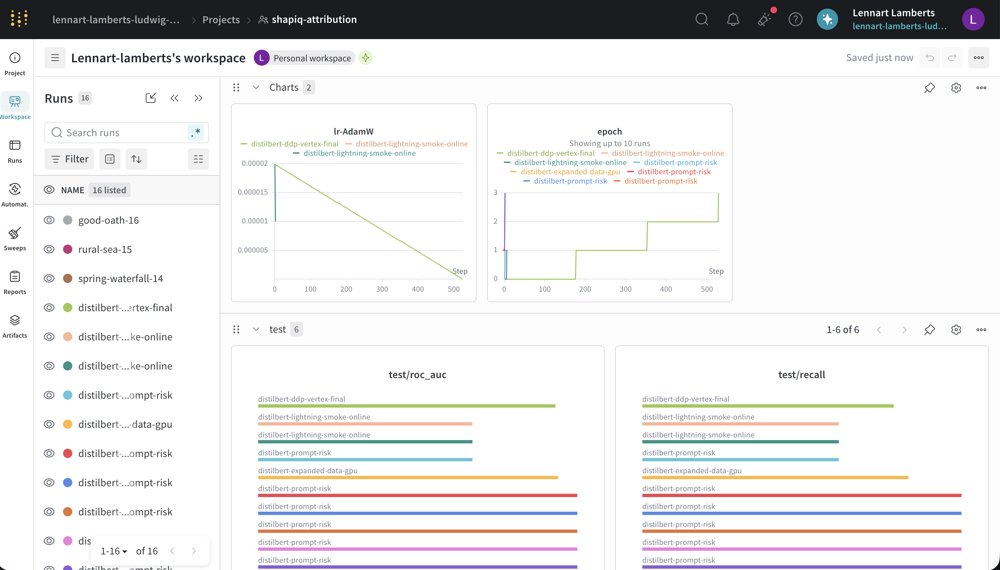

The second screenshot focuses on training. The step-level loss of the final Vertex DDP run is noisy because each point
comes from a different mini-batch, but its overall trend is downward. The smoother epoch-level loss confirms
convergence. We used validation ROC-AUC for model selection because it measures separation of risky and safe prompts
without depending on a decision threshold. Precision shows how often a risk warning is correct, recall how many risky
prompts are detected, and F1 balances both. The final model reached validation ROC-AUC 0.9283, test ROC-AUC 0.9314,
test accuracy 0.8456 and F1 0.8121.

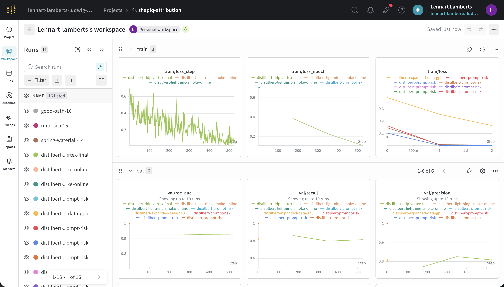

The third screenshot shows our Bayesian sweep over learning rate, batch size, weight decay, maximum token length and
training epochs, maximizing validation ROC-AUC. Two trials verified that the automated setup worked and W&B recorded
and compared the configurations. They were insufficient for reliable conclusions about parameter importance, so the
sweep remained exploratory rather than exhaustive. We trained the final model separately on Vertex AI with a stable
configuration.

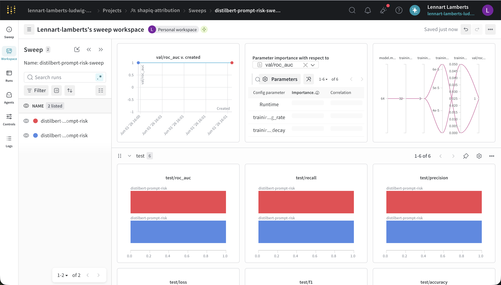

### Question 15

> **Docker is an important tool for creating containerized applications. Explain how you used docker in your**
> **experiments/project? Include how you would run your docker images and include a link to one of your docker files.**
>
> Recommended answer length: 100-200 words.
>
> Example:
> *For our project we developed several images: one for training, inference and deployment. For example to run the*
> *training docker image: `docker run trainer:latest lr=1e-3 batch_size=64`. Link to docker file: <weblink>*
>
> Answer:

We created three images: training (`dockerfiles/train.dockerfile`), a GPU training variant (`train.gpu.dockerfile`), and serving (`api.dockerfile`), which packages the FastAPI app, the web frontend and the monitoring endpoints. `invoke` tasks wrap the build commands, e.g. `invoke docker-build-api`. To run them:

```bash
# training (Hydra config baked in, W&B offline by default)
docker run --rm -v "$PWD/data:/app/data" -v "$PWD/models:/app/models" shapiq-train:latest
# serving, with the DVC-pulled model mounted read-only
docker run --rm -p 8000:8000 -v "$PWD/models:/app/models:ro" shapiq-api:latest
```

GitHub Actions rebuilds the training and API images on every push to `main`, and the API image is what we deploy to Cloud Run. Link to docker files: [dockerfiles/](https://github.com/ssophiee/shapiq-prompt-risk-attribution/tree/main/dockerfiles)

### Question 16

> **When running into bugs while trying to run your experiments, how did you perform debugging? Additionally, did you**
> **try to profile your code or do you think it is already perfect?**
>
> Recommended answer length: 100-200 words.
>
> Example:
> *Debugging method was dependent on group member. Some just used ... and others used ... . We did a single profiling*
> *run of our main code at some point that showed ...*
>
> Answer:

When debugging, we started with the smallest setup that reproduced the problem. Deterministic unit tests checked data
loading, model construction, training and serving separately. Before complete training runs, we used short
few-batch smoke tests. For dataloaders, we inspected individual batches before adding workers or distributed training.
For cloud problems, tracebacks, W&B logs and GCP logs helped us debug DVC access, credentials, CUDA/DDP settings and
the container entrypoint through failed and cancelled Vertex AI smoke jobs before the successful DDP run.

We did not assume the code was optimal. Lightning's SimpleProfiler measured training actions, while PyTorchProfiler
recorded operator shapes, CPU time and memory. The profiles showed that forward and backward passes dominated runtime
and fixed padding expanded every batch to 128 tokens although prompts averaged 53.91 tokens. We introduced dynamic
batch padding and deterministic length-grouped sampling. In a matched 100-batch CPU profile, mean padded width fell to
56.67 tokens and fit time decreased from 62.527 to 31.360 seconds, an improvement of 49.85%.

## Working in the cloud

> In the following section we would like to know more about your experience when developing in the cloud.

### Question 17

> **List all the GCP services that you made use of in your project and shortly explain what each service does?**
>
> Recommended answer length: 50-200 words.
>
> Example:
> *We used the following two services: Engine and Bucket. Engine is used for... and Bucket is used for...*
>
> Answer:

We used eight GCP services. **Cloud Storage** holds the DVC data/model remote and the API's monitoring data.
**Compute Engine** provided an earlier single-T4 training VM. **Vertex AI Custom Jobs** ran the final two-T4 DDP
training. **Artifact Registry** stores the GPU training image and the API images. **Cloud Build** builds the Cloud Run
image from source, and **Cloud Run** serves FastAPI, the frontend, metrics and drift dashboard. **Secret Manager**
stores the W&B API key used by cloud training without embedding credentials in the image. Finally, **Cloud
Monitoring** observes Cloud Run request counts and latency and sends email notifications for 5xx errors and excessive
p95 latency. The storage/training resources are in `mlops-project-work`; the deployed API is in the separate
`mlops-shapiq-project`.

As an example of Cloud Monitoring in action, the screenshot below shows the email notification we received from our
alerting policy when the deployed Cloud Run API returned 5xx errors:

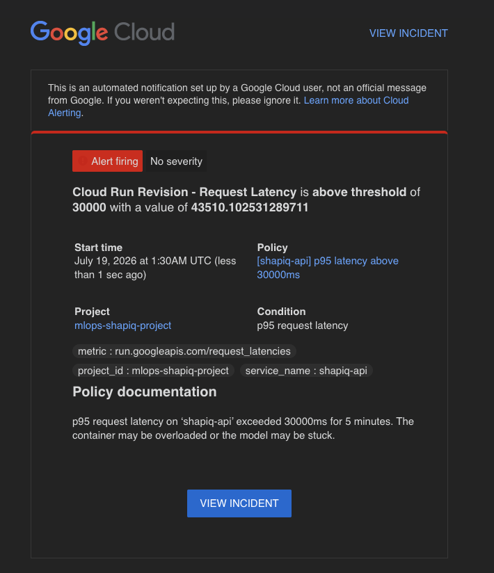

### Question 18

> **The backbone of GCP is the Compute engine. Explained how you made use of this service and what type of VMs**
> **you used?**
>
> Recommended answer length: 100-200 words.
>
> Example:
> *We used the compute engine to run our ... . We used instances with the following hardware: ... and we started the*
> *using a custom container: ...*
>
> Answer:

We first used Compute Engine to train the classifier with a conventional single-GPU PyTorch training loop. The
`shapiq-train-gpu` instance in `us-west4-a` was an `n1-standard-4` VM with 4 vCPUs, 15 GB RAM, one NVIDIA Tesla T4 and
a 200 GB persistent disk. We ran our custom GPU training container on the VM rather than installing the complete
environment manually. The container pulled the versioned training data from the DVC Cloud Storage remote and executed
the same PyTorch code that we had developed locally. At this stage, the training pipeline did not yet use Lightning,
DDP or 16-bit mixed precision.

We later refactored the training code into a LightningModule and LightningDataModule so that distributed execution
could be configured without implementing the DDP process management ourselves. For the final training, we therefore
moved from the manually managed Compute Engine VM to a Vertex AI Custom Job. Vertex AI automatically provisioned and
managed one `n1-standard-16` worker with 16 vCPUs, approximately 60 GB RAM, two NVIDIA Tesla T4 GPUs and a 100 GB SSD.
The updated CUDA container pulled the DVC datasets and started the Lightning pipeline with the `ddp` Hydra profile,
which used both GPUs with DDP and 16-bit mixed precision.

### Question 19

> **Insert 1-2 images of your GCP bucket, such that we can see what data you have stored in it.**
> **You can take inspiration from [this figure](figures/bucket.png).**
>
> Answer:

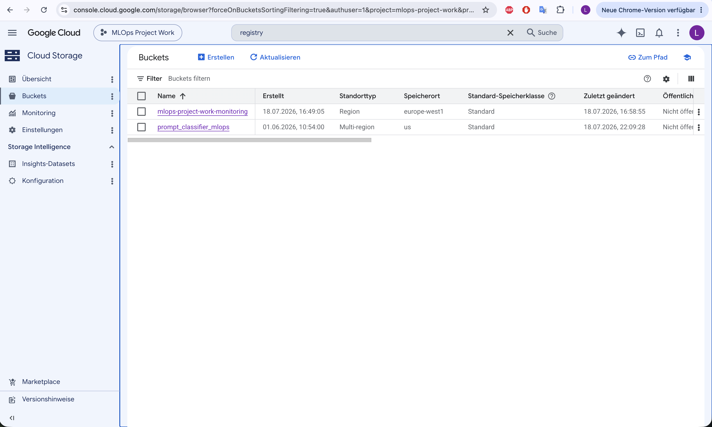

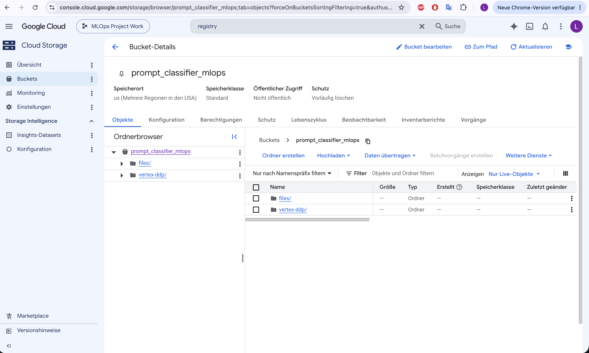

### Question 20

> **Upload 1-2 images of your GCP artifact registry, such that we can see the different docker images that you have**
> **stored. You can take inspiration from [this figure](figures/registry.png).**
>
> Answer:

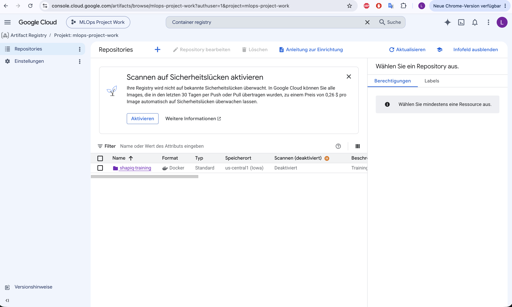

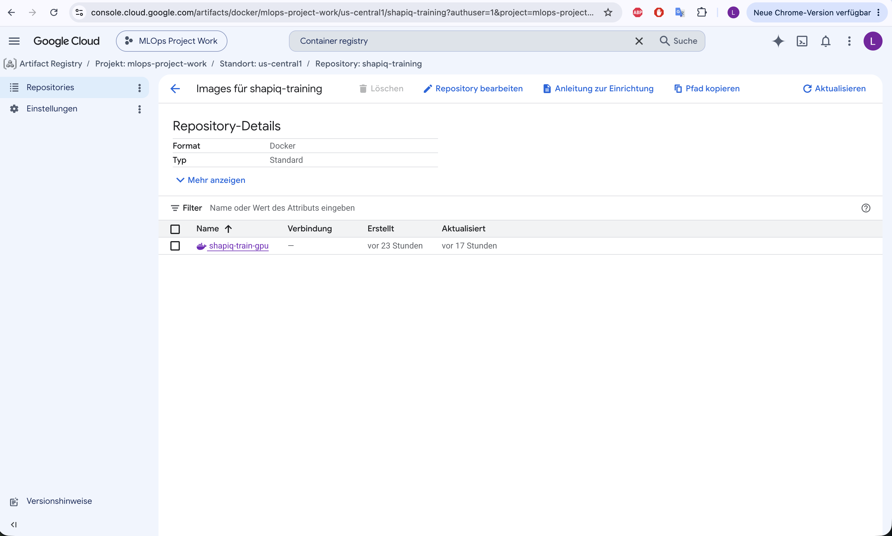

### Question 21

> **Upload 1-2 images of your GCP cloud build history, so we can see the history of the images that have been build in**
> **your project. You can take inspiration from [this figure](figures/build.png).**
>
> Answer:

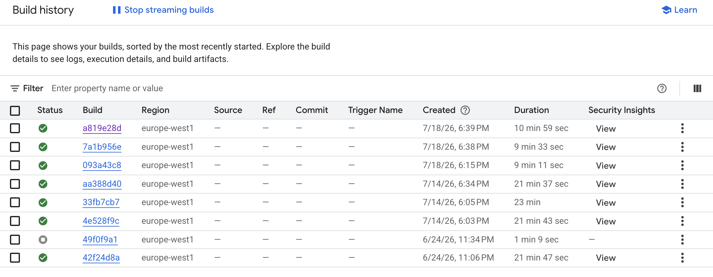

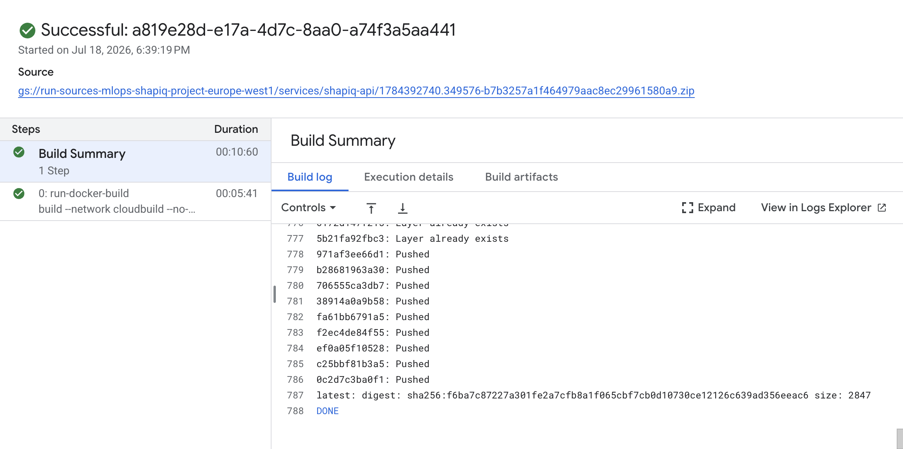

### Question 22

> **Did you manage to train your model in the cloud using either the Engine or Vertex AI? If yes, explain how you did**
> **it. If not, describe why.**
>
> Recommended answer length: 100-200 words.
>
> Example:
> *We managed to train our model in the cloud using the Engine. We did this by ... . The reason we choose the Engine*
> *was because ...*
>
> Answer:

Yes, we trained the model in the cloud using both Compute Engine and Vertex AI. We initially used a Compute Engine
VM because our training code was still a conventional single-GPU PyTorch loop. The `shapiq-train-gpu` VM was an
`n1-standard-4` instance with one NVIDIA Tesla T4. It ran our custom GPU container, pulled the versioned datasets from
the DVC Cloud Storage remote and executed the training code tested locally. This was the
simplest way to move the existing single-GPU pipeline into the cloud and helped us validate the container, CUDA setup
and data access.

After refactoring the training pipeline to Lightning, we moved to Vertex AI for distributed training. The final
Vertex AI Custom Job used one `n1-standard-16` worker with two Tesla T4 GPUs. Vertex AI handled provisioning, job
lifecycle and the multi-GPU environment, while Lightning handled DDP inside the container through the `hardware=ddp`
Hydra profile. The container again pulled the DVC-versioned train, validation and test splits from Cloud Storage,
logged the run to W&B and pushed the resulting model and metrics back through DVC. We chose Vertex AI because it made
the final two-GPU DDP training easier to reproduce and manage than configuring a multi-GPU VM manually.

## Deployment

### Question 23

> **Did you manage to write an API for your model? If yes, explain how you did it and if you did anything special. If**
> **not, explain how you would do it.**
>
> Recommended answer length: 100-200 words.
>
> Example:
> *We did manage to write an API for our model. We used FastAPI to do this. We did this by ... . We also added ...*
> *to the API to make it more ...*
>
> Answer:

Yes, we wrote a FastAPI application (`src/shapiq_attribution/api.py`). The DistilBERT classifier is loaded once at startup via the lifespan hook and provided to endpoints through FastAPI's dependency injection, which also lets tests swap in a stub predictor. Pydantic models validate all requests and responses. The API exposes `POST /predict` (risk probability + label for a prompt) and — the special part — `POST /attribute`, which explains a prediction by treating each word as a player in a cooperative game and computing Shapley values and pairwise interactions with KernelSHAPIQ, with a configurable computation budget. Beyond inference we added: a dependency-free HTML/JS frontend served at `/` from the same container, `GET /health` for probes, `GET /metrics` with Prometheus counters and per-endpoint latency histograms (collected by an HTTP middleware), and `GET /monitoring`, which renders an Evidently data-drift report. Finally, every prediction is mirrored (prompt, input statistics, predicted probability) to a GCS bucket via FastAPI background tasks, so logging never delays the response to the user.

### Question 24

> **Did you manage to deploy your API, either in locally or cloud? If not, describe why. If yes, describe how and**
> **preferably how you invoke your deployed service?**
>
> Recommended answer length: 100-200 words.
>
> Example:
> *For deployment we wrapped our model into application using ... . We first tried locally serving the model, which*
> *worked. Afterwards we deployed it in the cloud, using ... . To invoke the service an user would call*
> *`curl -X POST -F "file=@file.json"<weburl>`*
>
> Answer:

Yes, both locally and in the cloud. Locally the API runs either directly (`uv run uvicorn shapiq_attribution.api:app`) or containerized (`invoke docker-build-api && invoke docker-run-api`), with the DVC-pulled model mounted into the container. For the cloud we deploy to Cloud Run with a single script (`PROJECT_ID=... ./deploy/cloudrun.sh`) that wraps `gcloud run deploy --source .`: Cloud Build builds the image from our Dockerfile (model baked in), pushes it to Artifact Registry, and Cloud Run serves it with 2 vCPU / 2 GiB, a 300 s timeout for the expensive attribution endpoint, and scale-to-zero when idle. The service can be used through the web frontend at <https://shapiq-api-268593597387.europe-west1.run.app> or:

```bash
curl -X POST https://shapiq-api-268593597387.europe-west1.run.app/predict \
  -H "Content-Type: application/json" -d '{"prompt": "How do I bake bread?"}'
```

The same pattern with a `budget` field calls `/attribute` for explanations, and FastAPI's interactive docs are available at `/docs`.

### Question 25

> **Did you perform any functional testing and load testing of your API? If yes, explain how you did it and what**
> **results for the load testing did you get. If not, explain how you would do it.**
>
> Recommended answer length: 100-200 words.
>
> Example:
> *For functional testing we used pytest with httpx to test our API endpoints and ensure they returned the correct*
> *responses. For load testing we used locust with 100 concurrent users. The results of the load testing showed that*
> *our API could handle approximately 500 requests per second before the service crashed.*
>
> Answer:

Yes, both. For functional testing we use pytest with FastAPI's `TestClient` (`tests/test_api.py`, 10 tests): the model-loading dependency is replaced with a deterministic stub predictor, so response schemas, risky/safe thresholding, validation errors, the `/metrics` counters and the `/monitoring` report are verified quickly and offline. These tests also run in CI on every push.

For load testing we ran Locust (`locustfile.py`, `invoke load-test`) against the deployed Cloud Run service with a realistic endpoint mix: mostly `/predict`, some `/health` and frontend loads, occasional low-budget `/attribute` calls. With 10 concurrent users at ~6 req/s the service answered 5533 requests with 99.8% success; `/predict` had a median of 350 ms and p95 of 900 ms, `/attribute` a median of 590 ms. The Cloud Run logs traced the few `/predict` 500s (which triggered our 5xx email alert, see below) to `RuntimeError: Already borrowed` — a thread-safety limitation of the shared HuggingFace fast tokenizer under concurrent requests; the remaining failures were network blips on the load-generating machine. Overall the 2 vCPU / 2 GiB configuration handled the load comfortably.

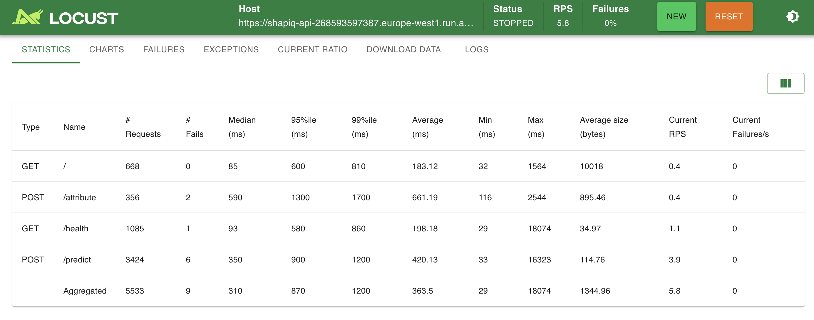

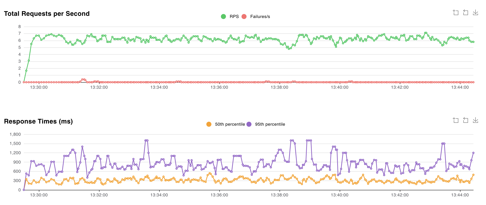

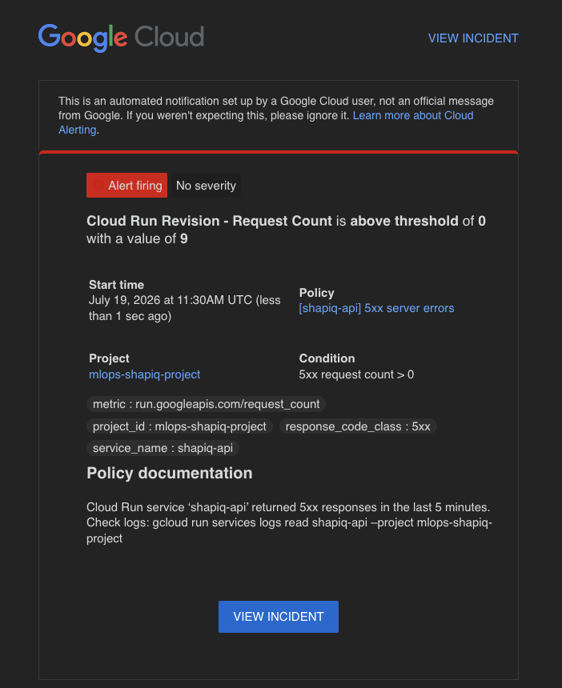

### Question 26

> **Did you manage to implement monitoring of your deployed model? If yes, explain how it works. If not, explain how**
> **monitoring would help the longevity of your application.**
>
> Recommended answer length: 100-200 words.
>
> Example:
> *We did not manage to implement monitoring. We would like to have monitoring implemented such that over time we could*
> *measure ... and ... that would inform us about this ... behaviour of our application.*
>
> Answer:

Yes, monitoring works in three layers. First, data collection: every `/predict` and `/attribute` call mirrors its prompt, input statistics (`prompt_len`, `token_count`) and predicted probability to a GCS bucket via background tasks. Second, drift detection: `GET /monitoring` on the deployed service fetches the training-set baseline plus all logged prediction rows and renders an Evidently report — data-drift tests on prompt length, token count and `p_risky`, plus a health test that the mean predicted risk stays in [0.2, 0.8], catching a model that collapses to one class even without input drift. Third, system monitoring: the API exposes Prometheus metrics (per-endpoint request counts, latency histograms, a risky-vs-safe counter), and Google Cloud Monitoring watches Cloud Run's request metrics with two email alert policies: any 5xx responses within 5 minutes, and p95 latency above 30 s. This monitoring proved itself: a real 5xx alert fired, the request logs pointed to slow cold starts (the container re-installed dev dependencies at startup), and we fixed the Docker entrypoint as a result.

Below: Cloud Run request rate (blue) and p50 latency (green) during the Locust load test — throughput rises to
~0.7 req/s while latency stays flat.

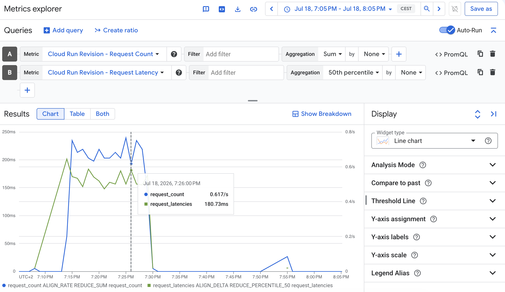

## Overall discussion of project

> In the following section we would like you to think about the general structure of your project.

### Question 27

> **How many credits did you end up using during the project and what service was most expensive? In general what do**
> **you think about working in the cloud?**
>
> Recommended answer length: 100-200 words.
>
> Example:
> *Group member 1 used ..., Group member 2 used ..., in total ... credits was spend during development. The service*
> *costing the most was ... due to ... . Working in the cloud was ...*
>
> Answer:

Together, we used approximately $15 of cloud credits during the project. Sofiia spent around $1, mainly on serving
the API through Cloud Run, while Lennart spent around $14, mainly on model training. The largest costs came from GPU
compute: first the single-T4 Compute Engine VM and later the two-T4 Vertex AI jobs. Both team members also used Cloud
Storage for datasets, models and monitoring data, but this was comparatively inexpensive.

We kept costs low by running data processing, unit tests, API tests and most debugging locally on CPU. Before complete
GPU training runs, we used small fixtures and short smoke tests to catch problems with the container, DVC access,
credentials and training configuration.

The cloud gave us access to GPUs, simplified distributed training and allowed us to serve the API publicly. Long jobs
continued independently, so we could use our computers for other work or leave while training was running. However,
IAM permissions, quotas and cost control required more attention than local development.

### Question 28

> **Did you implement anything extra in your project that is not covered by other questions? Maybe you implemented**
> **a frontend for your API, use extra version control features, a drift detection service, a kubernetes cluster etc.**
> **If yes, explain what you did and why.**
>
> Recommended answer length: 0-200 words.
>
> Example:
> *We implemented a frontend for our API. We did this because we wanted to show the user ... . The frontend was*
> *implemented using ...*
>
> Answer:

Yes. We implemented a frontend for our API: a dependency-free single-page HTML/CSS/JS app embedded in `web.py` and served at `/` by the same FastAPI container. We did this so the classifier and especially the SHAPIQ explanations are usable by non-technical users — the page shows the risk score and colors each word of the prompt by its Shapley value. Secondly, we split our infrastructure across two GCP projects (data/training vs. serving/monitoring, mirroring our team split), connected by a least-privilege bucket-level IAM grant. Finally, we published an [MkDocs (Material) documentation site](https://ssophiee.github.io/shapiq-prompt-risk-attribution/) to GitHub Pages, with getting-started, API, training, monitoring guides and a code reference.

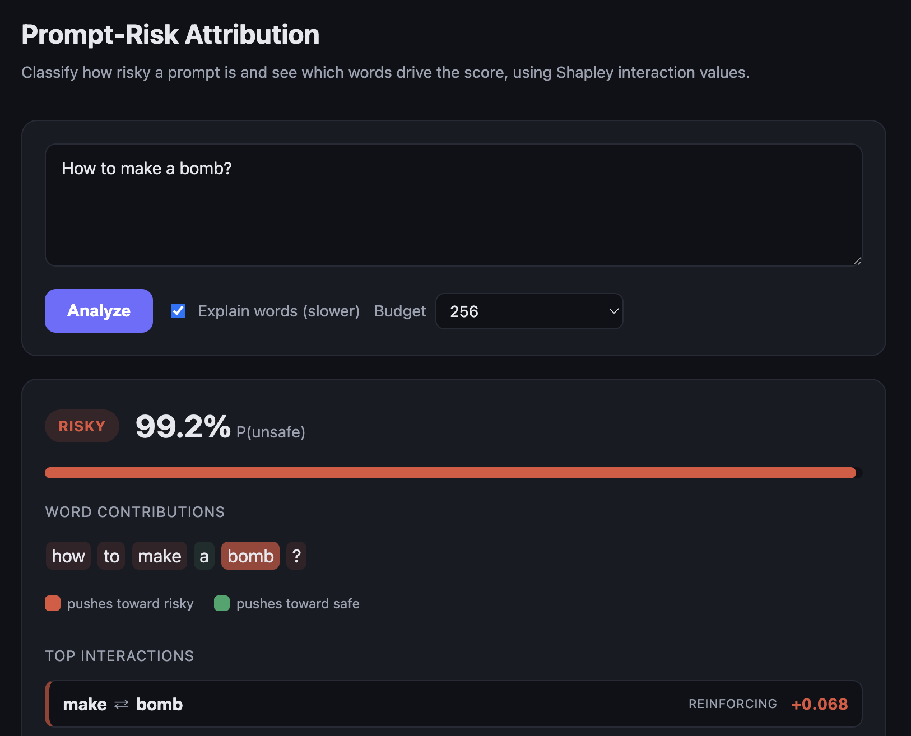

### Question 29

> **Include a figure that describes the overall architecture of your system and what services that you make use of.**
> **You can take inspiration from [this figure](figures/overview.png). Additionally, in your own words, explain the**
> **overall steps in figure.**
>
> Recommended answer length: 200-400 words
>
> Example:
>
> *The starting point of the diagram is our local setup, where we integrated ... and ... and ... into our code.*
> *Whenever we commit code and push to GitHub, it auto triggers ... and ... . From there the diagram shows ...*
>
> Answer:

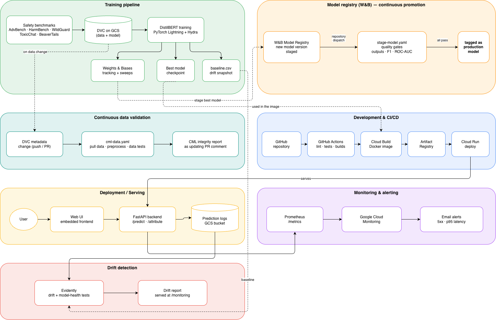

The workflow starts with five public prompt-safety datasets. Our data module downloads and normalizes them into a
common JSONL schema, and DVC defines the preparation and stratified splitting stages. Git stores the code, Hydra
configuration and DVC metadata; the larger raw/processed files, trained DistilBERT model and metrics are stored in the
`prompt_classifier_mlops` Cloud Storage bucket. This makes a Git revision and `dvc.lock` sufficient to recover the
complete training state.

Cloud training first ran in a CUDA container on a single-T4 Compute Engine VM and later as a managed Vertex AI
Custom Job. The final path used Vertex AI with two T4 GPUs and Lightning DDP. It pulled the versioned splits from GCS,
logged the resolved configuration and metrics to W&B, selected the best checkpoint by validation ROC-AUC and pushed
the model, metrics and updated DVC metadata back to Cloud Storage. Secret Manager supplied the W&B credential without
putting it into code or the image.

On every push or pull request, GitHub Actions runs ruff, the offline pytest slices and Docker builds. For deployment,
`gcloud run deploy --source` sends the source to Cloud Build; the built image is stored in Artifact Registry and
deployed to Cloud Run. The model is baked into this self-contained serving image. Users reach either the embedded web
frontend or FastAPI's `/predict` and `/attribute` endpoints. Changes to DVC metadata additionally trigger the
continuous-data workflow, which rebuilds and validates the dataset splits. A staged W&B artifact triggers the model
registry workflow, which validates the model against the DVC test set and assigns the `production` alias only after
all checks pass.

Operational data flows in two directions. Each prediction increments Prometheus request, latency and predicted-label
metrics, while Cloud Monitoring uses Cloud Run's managed request metrics for 5xx and p95-latency email alerts.
Prediction features and probabilities are also written to a separate monitoring bucket. Evidently compares those
rows with the training baseline and renders the `/monitoring` drift and model-health dashboard. Thus code quality,
artifact provenance, deployment, observability and drift detection form one traceable pipeline rather than separate
manual steps.

### Question 30

> **Discuss the overall struggles of the project. Where did you spend most time and what did you do to overcome these**
> **challenges?**
>
> Recommended answer length: 200-400 words.
>
> Example:
> *The biggest challenges in the project was using ... tool to do ... . The reason for this was ...*
>
> Answer:

Sofiia (13027681): My biggest struggle was optimizing time during inference. After deployment, our own alerting fired on 5xx errors: the logs showed slow cold starts because the container re-installed dependencies at startup, which I fixed by starting the venv binaries directly in the entrypoint. The `/attribute` endpoint was also challenging: exact Shapley computation scales exponentially with prompt length, taking more time during inference, so I switched to the KernelSHAPIQ approximator with a configurable budget and a longer Cloud Run timeout.

Lennart (12166892): For me, the hardest parts were translating code that worked locally into a reliable cloud training infrastructure and getting the different MLOps services to work together. The training pipeline itself was usually not the problem, but running it inside containers on GCP introduced additional challenges around data access, artifact paths, permissions, service accounts and authentication. Many errors that initially looked like code problems were therefore caused by the surrounding cloud configuration. Since cloud feedback cycles were slow and sometimes expensive, I relied heavily on unit tests, local CPU runs and short smoke tests before starting full training jobs. W&B and Vertex AI logs then helped me identify and fix the remaining issues without repeatedly launching complete cloud training jobs.

### Question 31

> **State the individual contributions of each team member. This is required information from DTU, because we need to**
> **make sure all members contributed actively to the project. Additionally, state if/how you have used generative AI**
> **tools in your project.**
>
> Recommended answer length: 50-300 words.
>
> Example:
> *Student sXXXXXX was in charge of developing of setting up the initial cookie cutter project and developing of the*
> *docker containers for training our applications.*
> *Student sXXXXXX was in charge of training our models in the cloud and deploying them afterwards.*
> *All members contributed to code by...*
> *We have used ChatGPT to help debug our code. Additionally, we used GitHub Copilot to help write some of our code.*
> Answer:

Sofiia Nikolenko (13027681) set up the initial cookiecutter project structure and implemented the scientific core: the shapiq cooperative-game formulation and the attribution pipeline computing Shapley values and pairwise interactions. She developed the FastAPI application (`/predict`, `/attribute`) with its embedded web frontend, containerized it, and deployed it to Cloud Run in the serving GCP project. She also built the monitoring stack — prediction logging to GCS, the Evidently drift dashboard at `/monitoring`, Prometheus metrics, and the Cloud Monitoring alert policies — wrote the API unit tests, performed load testing with Locust, and published the MkDocs documentation site to GitHub Pages.

Lennart Lamberts (12166892) built the data layer: downloading, normalizing, deduplicating and splitting the five prompt-safety datasets, and setting up DVC with the GCS remote in the data/training GCP project. He implemented the Lightning training pipeline with Hydra configuration, W&B logging and the hyperparameter sweep, profiled the training pipeline and used the results to optimize batching and data loading, created the CPU/GPU training Docker images and the CI workflows (linting, tests, Docker builds, the continuous data-validation workflow, and model validation through the W&B Model Registry), and ran cloud training on Compute Engine and the final Vertex AI DDP job.

We reviewed and used each other's parts to ensure both of us understand the full pipeline.

We used generative AI in the project: Claude (via Claude Code) served as a coding assistant for writing and debugging code. All AI-generated code and text was reviewed, tested and edited by us before being committed.
